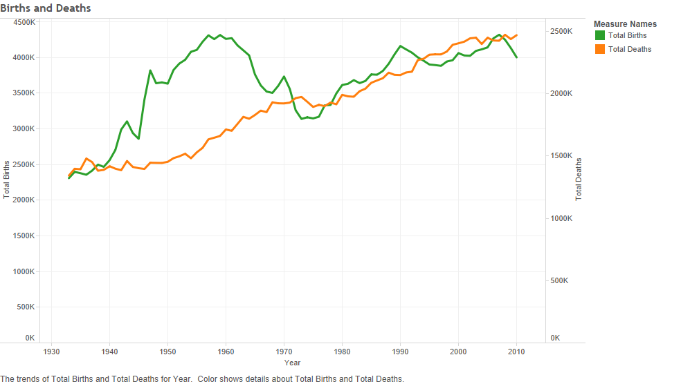
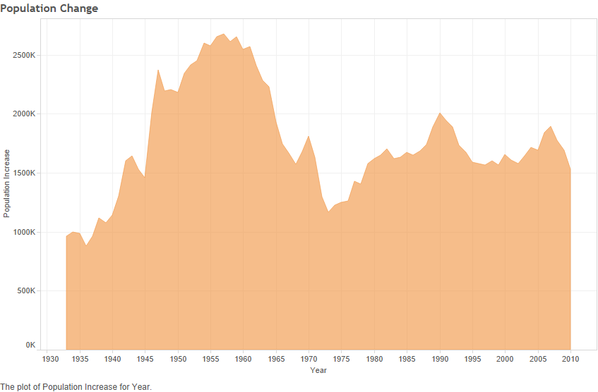
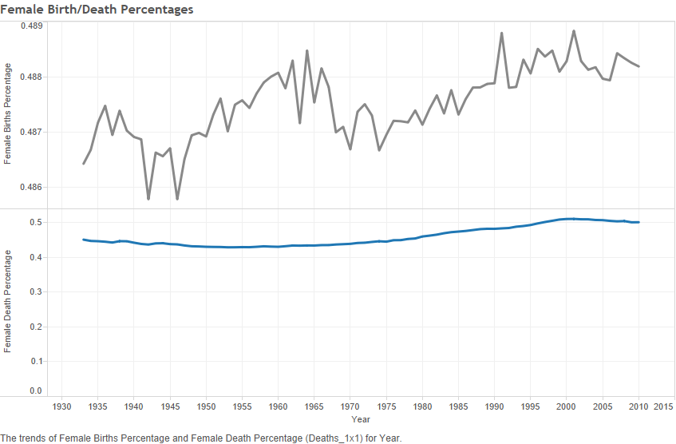
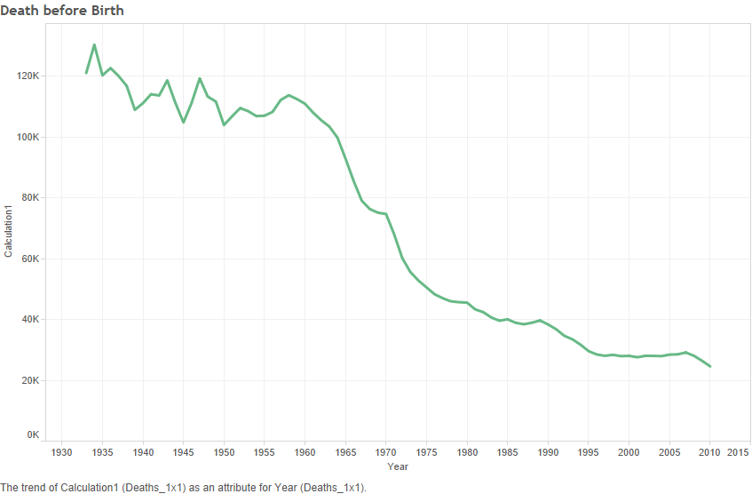

```{r}
source("../Rprofile.R", echo=FALSE) #load libraries
```

```{r}
source("../00 Doc/Crosstabs.R", echo=TRUE) #load crosstabs
tbl_df(dfbirth)
tbl_df(dfdeath)
```
```
Talbeau Data Blending Representations
```
```
Births and Deaths graph shows the sum of total births vs. deaths for each year
```

```
Population Increase graph shows the increase in population for each year. Population increase rate decrease tremendously from year 1960 to 1970.
```

```
Female Birth/Death Percentage graph shows the birth and death percentage of females for each year. Female death percentage increases slightly over the years whereas female birth percentage remains random throughout the years.
```

```
Death before Birth graph shows the sum of total deaths at the age of 0. The total death count decreases gradually as technology and medical care is improved.
```
